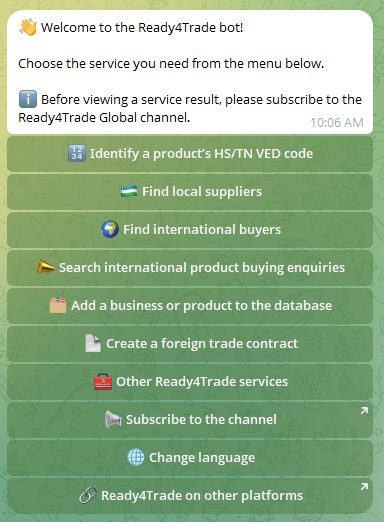
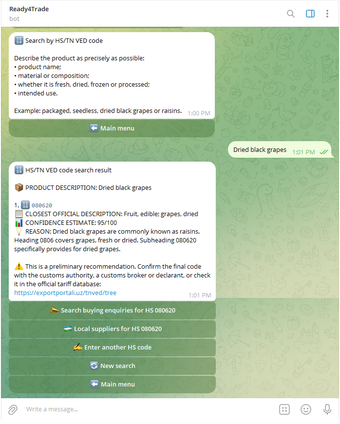

# Ready4Trade

**Ready4Trade** is a digital export-intelligence and market-access platform designed to help Uzbek SMEs, manufacturers, exporters, and entrepreneurs move from a local product to an international market through one accessible digital ecosystem.

> **From a local product to a global market.**

## Live MVP

- **Telegram Bot:** https://t.me/Ready4Trade_bot
- **Telegram Channel:** https://t.me/Ready4Trade_Global
- **Project Links:** https://taplink.cc/ready4trade
- **Export Opportunity Navigator:** https://export-opportunity-navigator-uzb-svk-production.up.railway.app/?perspective=UZB

## Project Status

**Stage:** MVP  
**Category:** Enterprise / TradeTech  
**Application:** President Tech Award — Incubation Program, Uzbekistan

Ready4Trade already has a working Telegram-based user interface, export-support modules, structured trade and buyer datasets, and a web-based analytical dashboard. The current development priority is to validate the product with exporters, strengthen data quality and buyer relevance, integrate the existing modules, and prepare the platform for go-to-market.

## The Problem

Uzbek businesses can produce competitive goods, but the path from having an exportable product to completing a transaction with a foreign buyer is still fragmented.

An exporter may need to use different websites, databases, institutions, consultants, marketplaces, logistics providers, certification bodies, and document templates just to answer basic questions:

- What is the correct HS / TN VED code for my product?
- Which foreign markets have demand for it?
- Where can I find potential international buyers?
- Which Uzbek suppliers can provide exportable products?
- Which markets offer the strongest untapped potential?
- How should I compare destination markets?
- What should be included in a foreign-trade contract?
- What logistics, payment, certification, branding, and packaging issues should I consider?

For SMEs and first-time exporters, this process can be slow, costly, and difficult to navigate.

## The Ready4Trade Solution

Ready4Trade brings key export-support functions into one digital journey:

**Product → HS classification → export readiness → market intelligence → buyer discovery → supplier matching → trade documentation → logistics & payments → international transaction**

The project combines a **mobile-first Telegram bot** with a **web-based trade-intelligence dashboard** and structured trade datasets.

## Current MVP Features

The current Telegram bot provides access to the following services:

- **HS / TN VED product classification**
- **Local supplier discovery**
- **International buyer discovery**
- **Search of international product-buying enquiries**
- **Business and product database registration**
- **Foreign-trade contract creation support**
- **Other export-support services**
- **Multilingual user interaction**
- **Links to the wider Ready4Trade ecosystem**

### Telegram Bot Interface

Ready4Trade Telegram bot main menu

Identify your product's Harmonised System (HS) code result

## Buyer & Market Intelligence

Ready4Trade's buyer-search infrastructure is built around a cleaned dataset of more than **20,000 international buyer leads**, together with ongoing work on structured company and buyer-profile data.

The project is designed to evolve beyond keyword search toward:

- product-to-buyer matching;
- buyer relevance scoring;
- buyer and company verification;
- country and sector filters;
- lead prioritization;
- exporter lead management;
- market-specific opportunity discovery.

## Export Opportunity Navigator

The **Export Opportunity Navigator** is the analytical layer of Ready4Trade.

Current analytical work includes:

- HS 2022 product structure;
- Revealed Comparative Advantage (RCA);
- product-level trade analysis;
- market comparison;
- export-opportunity visualization;
- buyer-lead exploration;
- logistics and payment information;
- market and product decision support.

The initial pilot has been developed around **Uzbekistan and Slovakia**, providing a research and technical foundation that can later be expanded to the European Union, Gulf countries, Central Asia, and other priority export markets.

**Live dashboard:**  
https://export-opportunity-navigator-uzb-svk-production.up.railway.app/?perspective=UZB

## Why Ready4Trade Matters for Uzbekistan

Uzbekistan's development priorities through 2030 place strong emphasis on export growth, diversification, higher-value products, international standards, stronger national brands, and a larger number of exporting enterprises.

Ready4Trade is designed as a practical digital layer that can support these priorities by reducing information asymmetry, market-search costs, and the complexity of entering foreign markets.

Relevant national priorities include:

- expanding the number of exporting enterprises;
- accelerating non-gold export growth;
- increasing the share of finished and semi-finished goods in exports;
- supporting companies in adopting international standards;
- developing internationally competitive Uzbek brands;
- identifying high-potential products and new export markets;
- improving access to digital export-support services.

**Policy source:**  
Decree of the President of the Republic of Uzbekistan No. DP-21, 16 February 2026:  
https://lex.uz/uz/docs/8050769

## Target Users

Ready4Trade is designed for:

- Uzbek SMEs;
- manufacturers;
- farmers and processors;
- first-time exporters;
- existing exporters seeking new markets;
- export consultants;
- business associations;
- trade-support organizations;
- international buyers searching for Uzbek suppliers.

The mobile-first approach is especially useful for entrepreneurs who actively use smartphones and Telegram but may not use complex professional trade databases.

## Technology & Data Approach

The MVP currently uses a practical, modular architecture built around:

- **Python-based backend services**
- **Telegram Bot interface**
- **structured CSV / trade datasets**
- **HS 2022 classification data**
- **buyer and company datasets**
- **trade-statistics processing**
- **RCA and market-analysis logic**
- **web-based analytical dashboard**
- **Railway deployment for the Opportunity Navigator**

The architecture is being developed so that individual modules can later be integrated into a more scalable API-driven platform.

## Planned Incubation Development

During the incubation stage, Ready4Trade will focus on moving from a functional MVP toward a validated go-to-market product.

Key priorities include:

1. **Intelligent product-to-market matching**
2. **Improved international buyer matching and verification**
3. **Export-readiness assessment**
4. **Country-specific market-entry and certification guidance**
5. **Exporter and supplier profiles**
6. **Lead management and B2B workflow**
7. **Improved trade analytics and opportunity scoring**
8. **Integration between Telegram and web analytics**
9. **Export branding and packaging readiness**
10. **Pilot validation with real Uzbek exporters**

## Team

### Foziljon Rustamov
**Founder & Product/Technology Lead**

- International Trade Development & Market Intelligence Specialist, Association of Exporters of Uzbekistan
- PhD Researcher, Tashkent State University of Economics
- Economics Lecturer, Turin Polytechnic University in Tashkent
- International research experience: University of Žilina, Slovakia
- Responsible for Ready4Trade product development, backend coding, data processing, trade research, analytics, and overall product direction

### Yorqin Malikov
**Export Strategy & Strategic Partnerships**

- Chairman, Association of Exporters of Uzbekistan
- Provides export-sector expertise, exporter access, institutional relationships, market-validation support, and strategic partnerships

### Lazizkhuja Sharipov
**Export Branding & Packaging Lead**

- Branding and packaging specialist
- Focuses on export-oriented packaging, brand positioning, and improving the international competitiveness of products under the **Made in Uzbekistan** identity

### Shavkat Najmiddinov
**Export Business Development & Market Validation**

- Exporter and business practitioner
- Association of Exporters of Uzbekistan
- Supports exporter relations, practical market validation, B2B development, and feedback from real export operations

## Team Advantage

Ready4Trade combines four capabilities that are often separated:

- **Technology & data** — product development, backend systems, datasets, analytics
- **International trade expertise** — exporter needs, market access, trade-development experience
- **Industry access** — direct engagement with Uzbek exporters and producers
- **Branding & market readiness** — packaging and positioning for foreign markets

This allows the product to be developed around real exporter problems rather than technology alone.

## International & Academic Context

The project benefits from the team's engagement in applied trade research and international academic cooperation.

The founder has completed two semesters of exchange and research study at the **University of Žilina, Slovakia**, contributing to the project's European market perspective and Uzbekistan–Slovakia trade analysis.

Ready4Trade also draws on ongoing academic and professional discussions around export-potential research, market intelligence, international trade, and B2B cooperation.

> Institutional and academic affiliations listed in this repository describe the team members' professional and research backgrounds and do not imply institutional endorsement of the project unless explicitly stated.

## Project Links

- Telegram Bot: https://t.me/Ready4Trade_bot
- Telegram Channel: https://t.me/Ready4Trade_Global
- Taplink: https://taplink.cc/ready4trade
- Export Opportunity Navigator: https://export-opportunity-navigator-uzb-svk-production.up.railway.app/?perspective=UZB

## Vision

Ready4Trade aims to become a digital gateway between Uzbek producers and global markets — helping an entrepreneur move from:

> **“Can I export this product?”**

to:

> **“Where should I sell it, who should I sell it to, and how can I enter that market?”**

within one accessible ecosystem.

---

**Ready4Trade — From a local product to a global market.**
